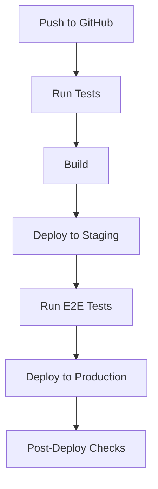

# CI/CD Guide

## Overview

This guide covers the complete CI/CD pipeline setup for URLs to OPML using GitHub Actions and Cloudflare deployment.

## Pipeline Structure



## GitHub Actions Configuration

### 1. Main Workflow

```yaml
# .github/workflows/main.yml
name: CI/CD Pipeline

on:
  push:
    branches: [ main ]
  pull_request:
    branches: [ main ]

jobs:
  test:
    runs-on: ubuntu-latest
    steps:
      - uses: actions/checkout@v3
      
      - name: Setup Node.js
        uses: actions/setup-node@v3
        with:
          node-version: '18'
          
      - name: Install Dependencies
        run: |
          cd frontend
          npm ci
          cd ../worker
          npm ci
          
      - name: Run Tests
        run: |
          cd frontend
          npm run test
          cd ../worker
          npm run test

  deploy-staging:
    needs: test
    if: github.event_name == 'pull_request'
    runs-on: ubuntu-latest
    steps:
      - uses: actions/checkout@v3
      
      - name: Deploy to Staging
        uses: cloudflare/wrangler-action@2.0.0
        with:
          apiToken: ${{ secrets.CF_API_TOKEN }}
          environment: staging

  deploy-production:
    needs: [test]
    if: github.ref == 'refs/heads/main'
    runs-on: ubuntu-latest
    steps:
      - uses: actions/checkout@v3
      
      - name: Deploy Worker
        uses: cloudflare/wrangler-action@2.0.0
        with:
          apiToken: ${{ secrets.CF_API_TOKEN }}
          
      - name: Deploy Frontend
        uses: cloudflare/pages-action@1.0.0
        with:
          apiToken: ${{ secrets.CF_API_TOKEN }}
          accountId: ${{ secrets.CF_ACCOUNT_ID }}
          projectName: urls-to-opml
          directory: frontend/.next
```

### 2. PR Checks Workflow

```yaml
# .github/workflows/pr-checks.yml
name: PR Checks

on:
  pull_request:
    branches: [ main ]

jobs:
  lint:
    runs-on: ubuntu-latest
    steps:
      - uses: actions/checkout@v3
      
      - name: Setup Node.js
        uses: actions/setup-node@v3
        with:
          node-version: '18'
          
      - name: Lint
        run: |
          cd frontend
          npm run lint
          
  type-check:
    runs-on: ubuntu-latest
    steps:
      - uses: actions/checkout@v3
      
      - name: Type Check
        run: |
          cd frontend
          npm run type-check
```

## Environment Configuration

### 1. Development

```env
# .env.development
NEXT_PUBLIC_API_URL=http://localhost:8787
ENVIRONMENT=development
```

### 2. Staging

```env
# .env.staging
NEXT_PUBLIC_API_URL=https://staging.urls-to-opml-api.workers.dev
ENVIRONMENT=staging
```

### 3. Production

```env
# .env.production
NEXT_PUBLIC_API_URL=https://urls-to-opml-api.workers.dev
ENVIRONMENT=production
```

## Deployment Configurations

### 1. Worker Configuration

```toml
# wrangler.toml
name = "urls-to-opml-api"
main = "src/worker.js"

[env.staging]
name = "urls-to-opml-api-staging"
route = "staging.urls-to-opml-api.workers.dev/*"

[env.production]
name = "urls-to-opml-api"
route = "urls-to-opml-api.workers.dev/*"
```

### 2. Pages Configuration

```json
// pages.json
{
  "builds": [
    {
      "src": "frontend/package.json",
      "use": "@cloudflare/next-on-pages"
    }
  ],
  "routes": [
    { "src": "/(.*)", "dest": "/frontend/$1" }
  ]
}
```

## Testing Strategy

### 1. Unit Tests

```typescript
// frontend/__tests__/RSSFeedFinder.test.tsx
import { render, fireEvent, waitFor } from '@testing-library/react';
import RSSFeedFinder from '../components/RSSFeedFinder';

describe('RSSFeedFinder', () => {
  it('should handle URL input', async () => {
    const { getByRole, getByText } = render(<RSSFeedFinder />);
    const input = getByRole('textbox');
    
    fireEvent.change(input, {
      target: { value: 'https://example.com' }
    });
    
    const button = getByText('Find Feeds');
    fireEvent.click(button);
    
    await waitFor(() => {
      expect(getByText('Loading...')).toBeInTheDocument();
    });
  });
});
```

### 2. E2E Tests

```typescript
// e2e/feed-finder.spec.ts
import { test, expect } from '@playwright/test';

test('should find feeds for valid URL', async ({ page }) => {
  await page.goto('http://localhost:3000');
  
  await page.fill('textarea', 'https://example.com');
  await page.click('text=Find Feeds');
  
  await expect(page.locator('.feed-results')).toBeVisible();
});
```

## Automation Scripts

### 1. Release Script

```bash
#!/bin/bash
# scripts/release.sh

VERSION=$1
CURRENT_BRANCH=$(git branch --show-current)

if [ "$CURRENT_BRANCH" != "main" ]; then
  echo "Must be on main branch"
  exit 1
fi

# Update version
npm version $VERSION

# Push changes
git push origin main --tags

# Create GitHub release
gh release create v$VERSION --generate-notes
```

### 2. Deployment Script

```bash
#!/bin/bash
# scripts/deploy.sh

ENVIRONMENT=$1

if [ "$ENVIRONMENT" = "production" ]; then
  wrangler deploy --env production
  npm run build
  wrangler pages publish .next
elif [ "$ENVIRONMENT" = "staging" ]; then
  wrangler deploy --env staging
fi
```

## Monitoring and Rollback

### 1. Health Check

```typescript
// worker/src/health.js
async function healthCheck() {
  const checks = {
    api: await checkAPI(),
    database: await checkDatabase(),
    cache: await checkCache()
  };
  
  return {
    status: Object.values(checks).every(c => c.status === 'healthy')
      ? 'healthy'
      : 'unhealthy',
    checks
  };
}
```

### 2. Rollback Script

```bash
#!/bin/bash
# scripts/rollback.sh

VERSION=$1

# Rollback worker
wrangler rollback $VERSION

# Rollback frontend
wrangler pages deployment rollback urls-to-opml $VERSION
```

## Quality Gates

### 1. Code Quality

- ESLint configuration
- Prettier setup
- TypeScript strict mode
- Test coverage > 80%

### 2. Performance

- Lighthouse score > 90
- Core Web Vitals pass
- API response time < 1s

### 3. Security

- Dependencies up to date
- No critical vulnerabilities
- OWASP compliance

[More documentation follows if needed...]